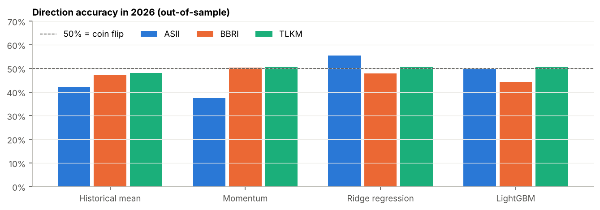
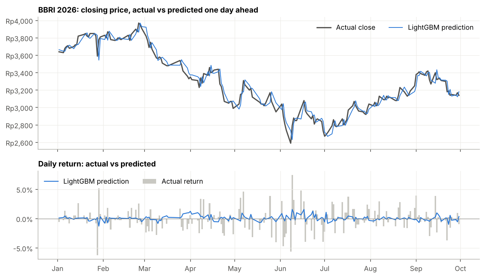
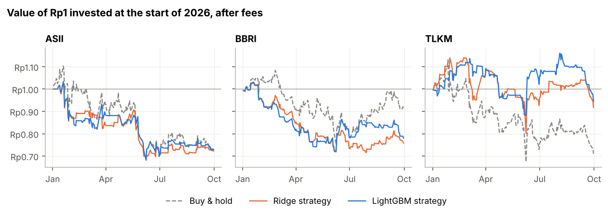
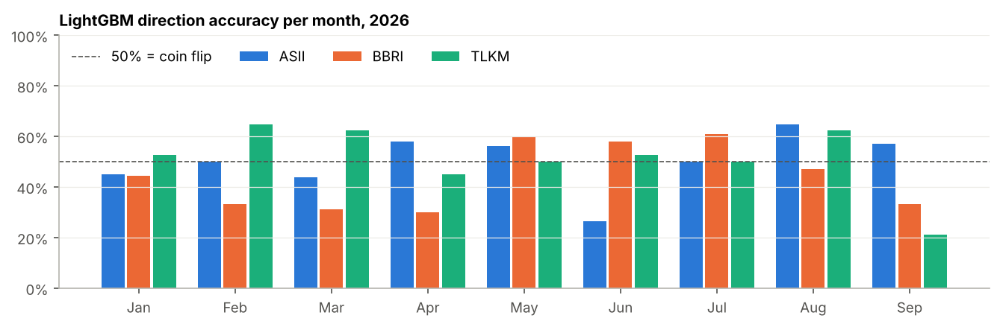
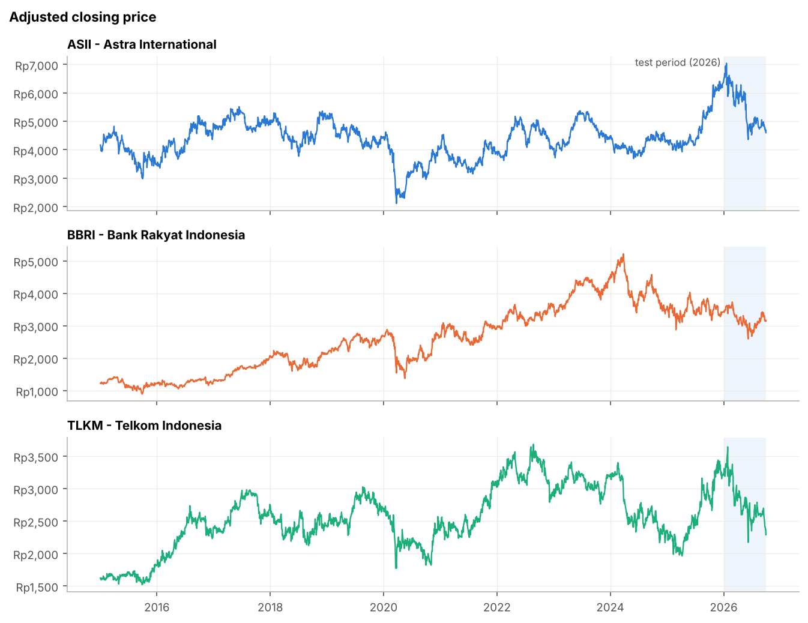
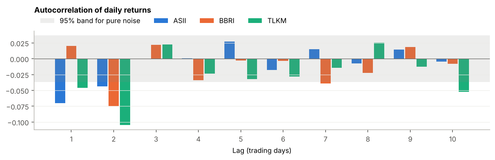

# IDX Stock Return Prediction 2026: ASII, BBRI and TLKM

[](https://colab.research.google.com/github/haikalfr04/Stocks-Prediction/blob/main/notebooks/idx_stock_prediction_colab.ipynb)


This project predicts the next-day return of three large Indonesian stocks, Astra International (ASII), Bank Rakyat
Indonesia (BBRI) and Telkom Indonesia (TLKM), for every trading day in 2026. It compares two machine learning models
(Ridge regression and LightGBM) with three simple baselines, and tests whether the predictions would have made money
after trading fees.

<!-- RESULTS: replace this line with one sentence on the main result, e.g. "**LightGBM predicted the direction of ... correctly on ...% of days in 2026, compared with ...% for the best baseline.**" -->

The project aims to answer three questions:

1. **Can a model predict the direction of tomorrow's price move better than simple rules?** The models are compared with a random walk (tomorrow's price equals today's), the historical average return, and momentum (today's move repeats tomorrow).
2. **Is a price prediction that looks accurate actually useful?** A predicted price is always close to today's price, so a chart of predicted vs actual prices looks good even for a model that knows nothing. The predicted prices are therefore compared with the naive prediction "tomorrow's price = today's price".
3. **Would trading on the predictions beat buying and holding the stock?** Each model is used in a simple strategy that holds the stock only when the model predicts a rise, after IDX broker fees.

## Results

> Results are produced by running the [notebook](notebooks/idx_stock_prediction_colab.ipynb) and are saved in
> [`results/`](results/). The full tables are in [`results/comparison.md`](results/comparison.md).

<!-- RESULTS: after running the notebook, paste the "Summary" table from results/comparison.md here. -->



### Key findings

<!-- RESULTS: write 3-4 findings based on results/comparison.md, for example:
- How LightGBM's direction accuracy compares with the best baseline, and whether the difference is larger than chance (about ±3.6 percentage points for 190 days).
- Whether the price RMSE of LightGBM is lower than the naive prediction.
- Whether the LightGBM strategy beat buy & hold after fees, and how many trades it made.
- Which features LightGBM relied on most.
-->

### Predictions for 2026

The top chart compares the actual closing price with LightGBM's prediction made the evening before. The two lines
almost overlap, but this is mostly because every prediction starts from the previous day's price. The bottom chart
shows the real test: the predicted daily returns (blue line) are much smaller than the actual returns (gray bars).



Charts for the other stocks: [ASII](results/figures/ASII_2026_predictions.png),
[TLKM](results/figures/TLKM_2026_predictions.png). Every daily prediction is saved in
[`results/predictions/`](results/predictions/).

### Trading strategy



### Accuracy per month

An overall accuracy close to 50% can hide months where the model did well or badly. Each month has only about 20
trading days, so monthly values between 35% and 65% can easily happen by chance.



### Data exploration

<!-- RESULTS: paste the table from results/eda_stats.md here. -->



The autocorrelation of daily returns shows how much yesterday's return says about today's. Values inside the gray band
are what pure noise would produce.



## Method

**Data.** Daily prices since 2015 are downloaded from Yahoo Finance (`ASII.JK`, `BBRI.JK`, `TLKM.JK`) and saved to an
Excel file with one sheet per stock. Prices are adjusted for dividends and stock splits, so returns do not show an
artificial drop on ex-dividend dates. Days with zero volume (holidays and trading halts) are removed.

**Target.** The models predict the next-day log return, $r_{t+1} = \ln(P_{t+1}/P_t)$, not the price. A predicted return
is turned into a predicted price with $\hat P_{t+1} = P_t \cdot e^{\hat r_{t+1}}$.

**Features.** All features for day $t$ use only information available at the close of day $t$. A unit test checks
this by changing future prices and verifying that past features stay the same.

| Feature | Description |
|---|---|
| `ret_lag1` to `ret_lag5` | Log return of today and the 4 previous days |
| `ret_mean_{5,10,20}`, `vol_{5,10,20}` | Mean and standard deviation of returns over 5, 10 and 20 days |
| `vol_ratio_5_20` | Short-term volatility relative to longer-term volatility |
| `dist_ma20`, `dist_ma50` | Distance of the price from its 20-day and 50-day moving averages |
| `rsi_14`, `macd`, `macd_hist` | Technical indicators: RSI (14 days) and MACD |
| `hl_range`, `close_in_range` | Daily high-low range, and where the close sits within it |
| `volume_z20` | Today's volume compared with the last 20 days |
| `day_of_week` | Monday = 0 to Friday = 4 |

**Models.**

| Model | Prediction |
|---|---|
| Random walk (baseline) | 0%: tomorrow's price equals today's |
| Historical mean (baseline) | The average daily return in the training data |
| Momentum (baseline) | Today's return repeats tomorrow |
| Ridge regression | Linear model with L2 regularization (alpha = 50) on standardized features |
| LightGBM | Gradient-boosted trees: 300 trees, learning rate 0.02, at most 15 leaves, at least 50 samples per leaf |

The LightGBM settings are deliberately conservative to limit overfitting on very noisy data. They were not tuned on
the 2026 test period.

**Walk-forward validation.** Stock data must not be split randomly, because the model would then learn from the
future. The first model is trained on all days before 2026 and predicts the next 21 trading days (about one month).
Those days are then added to the training data, the model is retrained, and it predicts the next 21 days. Every
prediction in 2026 therefore uses only information that was available at the time.

**Metrics.**

- **Direction accuracy:** the share of days on which the model predicted the correct direction (up or down). Days on which the closing price did not change are left out, because IDX stocks often close unchanged and these days have no direction. The random walk never predicts a direction, so it has no direction accuracy.
- **R² vs random walk:** $1 - \sum (r - \hat r)^2 / \sum r^2$. Positive values mean the model's errors are smaller than always predicting 0%. For daily stock returns, anything above 1% is considered very good (Campbell & Thompson, 2008).
- **Price RMSE:** the typical error of the predicted closing price in rupiah, compared with the naive prediction.

**Trading strategy.** At each close, the strategy holds the stock for the next day if the model predicts a positive
return, and holds cash otherwise. Short selling is not used, because it is generally not available to retail investors
on the IDX. A fee of 0.15% is charged on each purchase and 0.25% on each sale (including the 0.1% final income tax).
The strategy is compared with buy & hold, using total return, Sharpe ratio and maximum drawdown.

## Limitations and future work

- The test period covers less than one year (about 190 trading days per stock). With this sample size, a direction accuracy within about ±3.6 percentage points of 50% can happen by chance, so small differences between models are not reliable. Testing on several years (for example 2022-2026) would give stronger conclusions.
- The backtest assumes that every trade happens exactly at the closing price, with no slippage, and ignores lot sizes and price tick rules.
- The features use only prices and volume. News sentiment (for example with IndoBERT), macroeconomic data or foreign investor flows could add information.
- Predicting volatility instead of direction is a promising alternative, because volatility is much more predictable and useful for risk management.
- An LSTM or Transformer model could be compared using the same walk-forward procedure.

## Project structure

```
├── src/
│   ├── download.py    # downloads prices from Yahoo Finance into data/idx_prices.xlsx
│   ├── data.py        # loads the Excel file and adjusts prices for dividends and splits
│   ├── eda.py         # data exploration: statistics, price history, return distribution, autocorrelation
│   ├── features.py    # technical features and the next-day return target
│   ├── models.py      # baselines, Ridge regression and LightGBM
│   ├── evaluate.py    # walk-forward validation and forecast metrics
│   ├── backtest.py    # long-or-cash trading strategy with IDX fees
│   ├── run.py         # runs the 2026 experiment and saves tables, predictions and charts
│   ├── predict.py     # predicts the next trading day
│   ├── plots.py       # shared chart style
│   └── config.py      # stocks, test period, fees
├── notebooks/idx_stock_prediction_colab.ipynb   # runs the full project on Google Colab
├── data/              # idx_prices.xlsx (created by src.download)
├── tests/             # unit tests for features, walk-forward splits, metrics and backtest
└── results/           # metrics, comparison tables, daily predictions and charts
```

## How to run

The easiest way is to click the **Open in Colab** button at the top of this page and choose
**Runtime → Run all**. No GPU is needed, and the notebook takes about 2 minutes.

To run the project on your own computer:

```bash
pip install -r requirements.txt

python -m src.download      # download prices into data/idx_prices.xlsx
python -m src.eda           # explore the data
python -m src.run           # walk-forward prediction for 2026, comparison with baselines and backtest
python -m src.predict       # predict the next trading day
```

`src.download` accepts `--start`, `--end` and `--out`. The other scripts accept `--data path/to/file.xlsx` to use a
different Excel file. To check that everything works without an internet connection, add `--synthetic` to `src.eda`,
`src.run` or `src.predict`. This uses random-walk prices and writes the output to `results_synthetic/` instead of
`results/`.

To run the unit tests, use `pytest`.

## References

- Fama, 1970. *Efficient Capital Markets: A Review of Theory and Empirical Work.*
- Campbell & Thompson, 2008. *Predicting Excess Stock Returns Out of Sample: Can Anything Beat the Historical Average?*
- Ke et al., 2017. *LightGBM: A Highly Efficient Gradient Boosting Decision Tree.*
- Hoerl & Kennard, 1970. *Ridge Regression: Biased Estimation for Nonorthogonal Problems.*
- Wilder, 1978. *New Concepts in Technical Trading Systems* (RSI).

---

For learning and portfolio purposes only. This is not investment advice.
