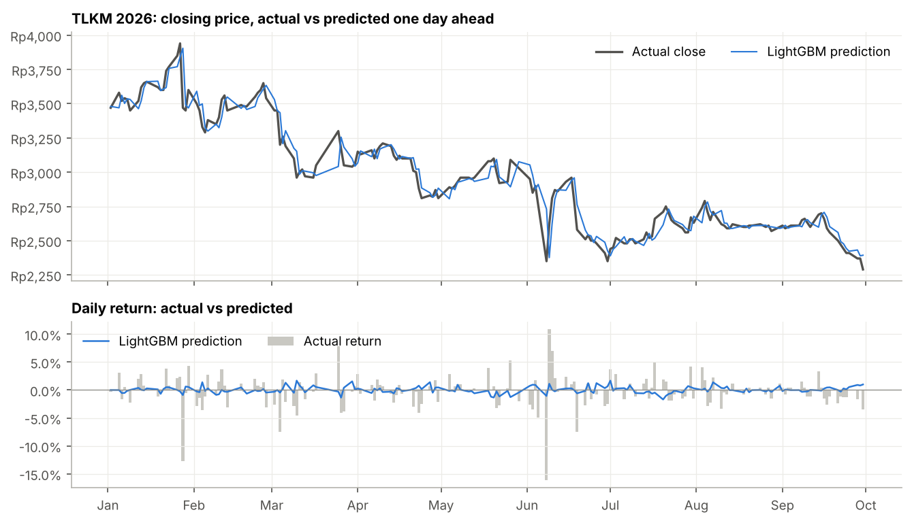
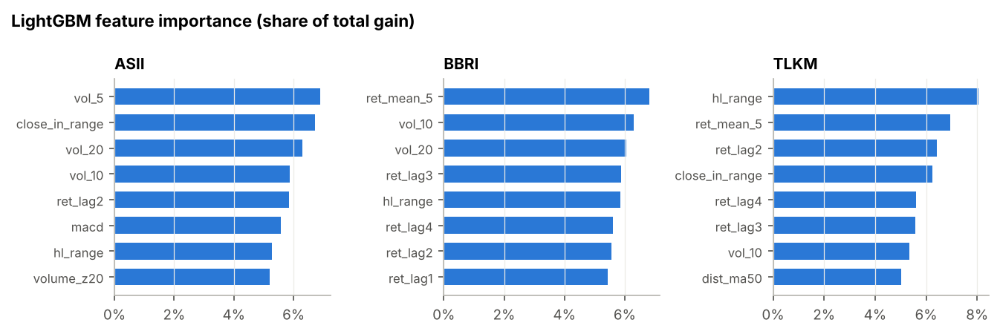

# IDX Stock Return Prediction 2026: ASII, BBRI and TLKM

[](https://colab.research.google.com/github/haikalfr04/Stocks-Prediction/blob/main/notebooks/idx_stock_prediction_colab.ipynb)


This project predicts the next-day return of three large Indonesian stocks, Astra International (ASII), Bank Rakyat
Indonesia (BBRI) and Telkom Indonesia (TLKM), for every trading day from January to September 2026. It compares two
machine learning models (Ridge regression and LightGBM) with three simple baselines, and tests whether the predictions
would have made money after trading fees. The data covers a fixed period, from January 2015 to 30 September 2026, so
every number below can be reproduced.

**Main result: no model predicted the daily direction better than chance in 2026.** LightGBM was right on 44-51% of
days, inside the ±7.6 percentage point range around 50% that a coin flip produces over 176 days. Its trading strategy
lost much less than buy & hold on TLKM (-5.6% vs -28.9%), but a luck test shows that random timing does this well 15%
of the time.

The project aims to answer three questions:

1. **Can a model predict the direction of tomorrow's price move better than simple rules?** The models are compared with a random walk (tomorrow's price equals today's), the historical average return, and momentum (today's move repeats tomorrow).
2. **Is a price prediction that looks accurate actually useful?** A predicted price is always close to today's price, so a chart of predicted vs actual prices looks good even for a model that knows nothing. The predicted prices are therefore compared with the naive prediction "tomorrow's price = today's price".
3. **Would trading on the predictions beat buying and holding the stock?** Each model is used in a simple strategy that holds the stock only when the model predicts a rise, after IDX broker fees.

## Results

> All results come from one run of the [notebook](notebooks/idx_stock_prediction_colab.ipynb) on data up to
> 30 September 2026, and are saved in [`results/`](results/). The full tables for every model are in
> [`results/comparison.md`](results/comparison.md). The test period runs from 2 January to 30 September 2026
> (176 trading days).

| Stock | Up days in 2026 | Direction accuracy (LightGBM) | Best baseline | Price RMSE (LightGBM) | Price RMSE (naive) | LightGBM strategy | Buy & hold | Shift test p-value |
|---|---|---|---|---|---|---|---|---|
| ASII | 42.3% | 50.0% | 42.3% (historical mean) | Rp171 | Rp168 | -27.0% | -28.0% | 0.56 |
| BBRI | 47.3% | 44.3% | 50.3% (momentum) | Rp68 | Rp66 | -22.0% | -8.8% | 0.62 |
| TLKM | 48.1% | 50.6% | 50.6% (momentum) | Rp85 | Rp86 | -5.6% | -28.9% | 0.15 |

<sub>*Up days* is the share of days with a price change on which the price rose. Strategy returns are after fees.
The *shift test p-value* is the share of time-shifted copies of the strategy (same number of days in the market and
trades, but unrelated timing) that earned at least as much. Values below 0.05 would suggest the timing is not luck.</sub>


### Key findings

- **2026 was a falling year, and no model saw it coming day by day.** All three stocks fell (ASII -28%, TLKM -29%, BBRI -9%), and prices rose on fewer than half of the days. Direction accuracy ranged from 44% to 51% for LightGBM and from 48% to 55% for Ridge regression. All of these are within the ±7.6 point range a coin flip produces over 176 days. Ridge regression on ASII (55.4%) came closest to the edge of that range, but it did not hold for the other two stocks.
- **Accurate-looking price predictions were no better than "tomorrow = today".** LightGBM's predicted closing prices were off by Rp68 to Rp171 on a typical day (about 2%). The naive prediction that tomorrow's price equals today's was just as accurate, and slightly better for ASII and BBRI.
- **Losing less than buy & hold was mostly a side effect of a falling market.** The LightGBM strategy held the stock on only about half of the days. In a year when the stocks fell sharply, being out of the market half the time reduces losses even with random timing. The shift test confirms this: random timing with the same number of days in the market did at least as well 15% (TLKM), 56% (ASII) and 62% (BBRI) of the time. Both model strategies still lost money on every stock, with negative Sharpe ratios.
- **The only positive R² comes from three days.** On TLKM, Ridge regression and LightGBM had a positive R² against the random walk (+3.8% and +1.2%), which would normally be a strong result for daily returns. Almost all of it comes from the crash on 8 June 2026 (from Rp2,760 to Rp2,350, -14.9%) and the rebound on the next two days (+11.5% and +7.3%). Without these three days, R² is -2.0% for Ridge and -6.7% for LightGBM.
- **Past returns contain a small, unusable pattern.** The autocorrelation chart shows small negative values at lags of 1 to 2 days (-0.07 for ASII, -0.08 for BBRI and -0.11 for TLKM). These are beyond the range of pure noise and mean that large moves tend to be partly reversed the next day or the day after. This also explains why the momentum baseline, which bets on the opposite, did worst on ASII (37.5%). The pattern is too weak to profit from after fees.

### Predictions for 2026

The top chart compares TLKM's actual closing price with LightGBM's prediction made the evening before. The two lines
almost overlap, but this is mostly because every prediction starts from the previous day's price. The bottom chart
shows the real test: the predicted daily returns (blue line) are much smaller than the actual returns (gray bars),
and the model did not anticipate the 15% drop on 8 June.



Charts for the other stocks: [ASII](results/figures/ASII_2026_predictions.png),
[BBRI](results/figures/BBRI_2026_predictions.png). Every daily prediction is saved in
[`results/predictions/`](results/predictions/).

### Trading strategy


### Accuracy per month

An overall accuracy close to 50% can hide months where the model did well or badly. Each month has only about 20
trading days, so monthly values between about 30% and 70% can happen by chance. LightGBM's monthly accuracy ranged
from 21% (TLKM, September) to 65% (ASII in August and TLKM in February), with no month in which the model did clearly
well for all three stocks.


### What the model looked at

LightGBM relied mostly on recent volatility (`vol_5`, `vol_10`, `vol_20`), the daily price range (`hl_range`,
`close_in_range`) and recent returns. Volatility features are useful for predicting how much a price will move, but
not in which direction, which matches the results above.



### Data exploration

| Stock | Period | Trading days | Close on 30 Sep 2026 | Annual volatility | Unchanged days | Return 2026 | Lag-1 autocorrelation |
|---|---|---|---|---|---|---|---|
| ASII | 2015-01-02 to 2026-09-30 | 2,818 | Rp4,600 | 32.5% | 10.6% | -27.9% | -0.070 |
| BBRI | 2015-01-02 to 2026-09-30 | 2,820 | Rp3,140 | 32.1% | 8.2% | -8.7% | +0.020 |
| TLKM | 2015-01-02 to 2026-09-30 | 2,818 | Rp2,290 | 30.3% | 8.6% | -28.8% | -0.046 |

About 8-11% of trading days close at exactly the same price as the day before. These days have no direction and are
left out when measuring direction accuracy.


The autocorrelation of daily returns shows how much the return of one day says about the return a few days later.
Values inside the gray band are what pure noise would produce.


### Prediction for the next trading day

LightGBM trained on all data up to 30 September 2026 predicts a small rise for all three stocks on the next trading
day ([`results/next_day_forecast.md`](results/next_day_forecast.md)). Given the results above, these numbers show how
the model works and should not be used to trade.

| Stock | Close on 30 Sep 2026 | Predicted return | Predicted close |
|---|---|---|---|
| ASII | Rp4,600 | +0.98% | Rp4,645 |
| BBRI | Rp3,140 | +0.20% | Rp3,146 |
| TLKM | Rp2,290 | +0.73% | Rp2,307 |

## Method

**Data.** Daily prices from 1 January 2015 to 30 September 2026 are downloaded from Yahoo Finance (`ASII.JK`,
`BBRI.JK`, `TLKM.JK`) and saved to [`data/idx_prices.xlsx`](data/idx_prices.xlsx), with one sheet per stock. Returns
are computed from prices adjusted for dividends and stock splits, so they do not show an artificial drop on
ex-dividend dates. Prices reported in rupiah are the actual closing prices on the IDX. Days with zero volume
(holidays and trading halts) are removed.

**Target.** The models predict the next-day log return, $r_{t+1} = \ln(P_{t+1}/P_t)$, not the price. A predicted return
is turned into a predicted price with $\hat P_{t+1} = P_t \cdot e^{\hat r_{t+1}}$.

**Features.** All features for day $t$ use only information available at the close of day $t$. A unit test checks
this by changing future prices and verifying that past features stay the same.

| Feature | Description |
|---|---|
| `ret_lag1` to `ret_lag5` | Log return of today and the 4 previous days |
| `ret_mean_{5,10,20}`, `vol_{5,10,20}` | Mean and standard deviation of returns over 5, 10 and 20 days |
| `vol_ratio_5_20` | Short-term volatility relative to longer-term volatility |
| `dist_ma20`, `dist_ma50` | Distance of the price from its 20-day and 50-day moving averages |
| `rsi_14`, `macd`, `macd_hist` | Technical indicators: RSI (14 days) and MACD |
| `hl_range`, `close_in_range` | Daily high-low range, and where the close sits within it |
| `volume_z20` | Today's volume compared with the last 20 days |
| `day_of_week` | Monday = 0 to Friday = 4 |

**Models.**

| Model | Prediction |
|---|---|
| Random walk (baseline) | 0%: tomorrow's price equals today's |
| Historical mean (baseline) | The average daily return in the training data |
| Momentum (baseline) | Today's return repeats tomorrow |
| Ridge regression | Linear model with L2 regularization (alpha = 50) on standardized features |
| LightGBM | Gradient-boosted trees: 300 trees, learning rate 0.02, at most 15 leaves, at least 50 samples per leaf |

The LightGBM settings are deliberately conservative to limit overfitting on very noisy data. They were not tuned on
the 2026 test period.

**Walk-forward validation.** Stock data must not be split randomly, because the model would then learn from the
future. The first model is trained on all days before 2026 and predicts the next 21 trading days (about one month).
Those days are then added to the training data, the model is retrained, and it predicts the next 21 days. Every
prediction in 2026 therefore uses only information that was available at the time.

**Metrics.**

- **Direction accuracy:** the share of days on which the model predicted the correct direction (up or down). Days on which the closing price did not change are left out, because IDX stocks often close unchanged and these days have no direction. The random walk never predicts a direction, so it has no direction accuracy.
- **R² vs random walk:** $1 - \sum (r - \hat r)^2 / \sum r^2$. Positive values mean the model's errors are smaller than always predicting 0%. For daily stock returns, anything above 1% is considered very good (Campbell & Thompson, 2008).
- **Price RMSE:** the typical error of the predicted closing price in rupiah, compared with the naive prediction.
- **Chance range:** over $n$ days, a coin flip's accuracy stays within $\pm 1.96\sqrt{0.25/n}$ of 50% in 95% of cases. For the 2026 test period this is about ±7.6 percentage points.

**Trading strategy.** At each close, the strategy holds the stock for the next day if the model predicts a positive
return, and holds cash otherwise. Short selling is not used, because it is generally not available to retail investors
on the IDX. A fee of 0.15% is charged on each purchase and 0.25% on each sale (including the 0.1% final income tax).
The strategy is compared with buy & hold, using total return, Sharpe ratio and maximum drawdown.

**Shift test.** A strategy that is out of the market half the time loses less than buy & hold in a falling year, even
if its timing is random. To check whether the timing itself is useful, the strategy's sequence of "hold" and "cash"
days is shifted in a circle by every possible number of days. Each shifted copy has the same number of days in the
market and about the same number of trades, but its timing has nothing to do with the predictions. The p-value is the
share of shifted copies that earned at least as much as the real strategy.

## Limitations and future work

- The test period covers nine months (176 trading days per stock), in a year when all three stocks fell. With this sample size, a direction accuracy within about ±7.6 percentage points of 50% can happen by chance, so small differences between models are not reliable. Testing on several years (for example 2022-2026) would give stronger conclusions.
- The backtest assumes that every trade happens exactly at the closing price, with no slippage, and ignores lot sizes and price tick rules.
- The features use only prices and volume. News sentiment (for example with IndoBERT), macroeconomic data or foreign investor flows could add information.
- Predicting volatility instead of direction is a promising alternative, because volatility is much more predictable and useful for risk management.
- An LSTM or Transformer model could be compared using the same walk-forward procedure.

## Project structure

```
├── src/
│   ├── download.py    # downloads prices for a fixed period from Yahoo Finance into data/idx_prices.xlsx
│   ├── data.py        # loads the Excel file and adjusts prices for dividends and splits
│   ├── eda.py         # data exploration: statistics, price history, return distribution, autocorrelation
│   ├── features.py    # technical features and the next-day return target
│   ├── models.py      # baselines, Ridge regression and LightGBM
│   ├── evaluate.py    # walk-forward validation and forecast metrics
│   ├── backtest.py    # long-or-cash trading strategy with IDX fees
│   ├── run.py         # runs the 2026 experiment and saves tables, predictions and charts
│   ├── predict.py     # predicts the first trading day after the data ends
│   ├── plots.py       # shared chart style
│   └── config.py      # stocks, data period, test period, fees
├── notebooks/idx_stock_prediction_colab.ipynb   # runs the full project on Google Colab
├── data/              # idx_prices.xlsx (created by src.download)
├── tests/             # unit tests for features, walk-forward splits, metrics and backtest
└── results/           # metrics, comparison tables, daily predictions and charts
```

## How to run

The easiest way is to click the **Open in Colab** button at the top of this page and choose
**Runtime → Run all**. No GPU is needed, and the notebook takes about 2 minutes. The data period is set at the start
of section 1 of the notebook (`START_DATE` and `END_DATE`).

To run the project on your own computer:

```bash
pip install -r requirements.txt

python -m src.download      # download prices from 2015-01-01 to 2026-09-30 into data/idx_prices.xlsx
python -m src.eda           # explore the data
python -m src.run           # walk-forward prediction for 2026, comparison with baselines and backtest
python -m src.predict       # predict the first trading day after the data ends
```

The default period is set in `src/config.py`. `src.download` also accepts `--start`, `--end` (last day included)
and `--out`. The other scripts accept `--data path/to/file.xlsx` to use a
different Excel file. To check that everything works without an internet connection, add `--synthetic` to `src.eda`,
`src.run` or `src.predict`. This uses random-walk prices and writes the output to `results_synthetic/` instead of
`results/`.

To run the unit tests, use `pytest`.

## References

- Fama, 1970. *Efficient Capital Markets: A Review of Theory and Empirical Work.*
- Campbell & Thompson, 2008. *Predicting Excess Stock Returns Out of Sample: Can Anything Beat the Historical Average?*
- Ke et al., 2017. *LightGBM: A Highly Efficient Gradient Boosting Decision Tree.*
- Hoerl & Kennard, 1970. *Ridge Regression: Biased Estimation for Nonorthogonal Problems.*
- Wilder, 1978. *New Concepts in Technical Trading Systems* (RSI).

---

For learning and portfolio purposes only. This is not investment advice.
